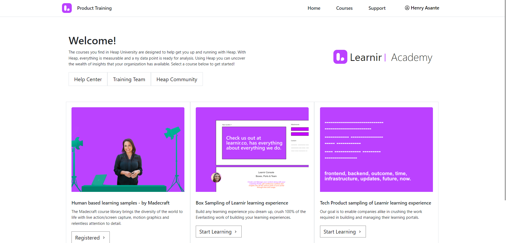

## Portal Simple
[](portal-web.png)
[](portal-mobile.png)
- Portal simple is well suited for companies looking for an industry standard template to deploy their product learning experiences.

[](https://app.netlify.com/start/deploy?repository=https://github.com/Learnir/portal-simple)


## Guide for developer
- It's nextjs and can be deployed on all forms of compute, popular of which is Vercel, Netlify and for AWS environmnets, Beanstalk
- Fork this repo, privatize it in your company repo
- Press [dot] on your keyboard and this code will be taken into a github editor mode
- Change in the /src/context/state (config properties) with your PORT access key
- Allow the domains on which you will be testing this portal template on
- Deploy and this template along with your content will be live

- You can improve on styling etc by working on the styles
- Portal simple is only a base for your imagination!

## Guide for non-developer
- Press [dot] right now on your keyboard
- An editor mode will open up
- Come back to this repo 
- Go to a popular service like netlify and signup an account
- Click on new site and connect your Github account
- Copy this current URL, up in your address bar

- Skip the technical parts of CLI etc and use the visual interface as explained here https://www.netlify.com/blog/2020/11/30/how-to-deploy-next.js-sites-to-netlify/
- Spend your free time reading this out https://www.netlify.com/resources/guides/next-js-on-the-jamstack
- Get yourself a drink 🍹


## Tech Stack
- Nextjs
- Bootstrap
- Learnir & learnir-javascript-sdk


## Nextjs Documentation
This is a [Next.js](https://nextjs.org/) project bootstrapped with [`create-next-app`](https://github.com/vercel/next.js/tree/canary/packages/create-next-app).

## Getting Started

First, run the development server:

```bash
npm run dev
# or
yarn dev
```

Open [http://localhost:3000](http://localhost:3000) with your browser to see the result.

You can start editing the page by modifying `pages/index.js`. The page auto-updates as you edit the file.

[API routes](https://nextjs.org/docs/api-routes/introduction) can be accessed on [http://localhost:3000/api/hello](http://localhost:3000/api/hello). This endpoint can be edited in `pages/api/hello.js`.

The `pages/api` directory is mapped to `/api/*`. Files in this directory are treated as [API routes](https://nextjs.org/docs/api-routes/introduction) instead of React pages.

## Learn More

To learn more about Next.js, take a look at the following resources:

- [Next.js Documentation](https://nextjs.org/docs) - learn about Next.js features and API.
- [Learn Next.js](https://nextjs.org/learn) - an interactive Next.js tutorial.

You can check out [the Next.js GitHub repository](https://github.com/vercel/next.js/) - your feedback and contributions are welcome!

## Deploy on Vercel

The easiest way to deploy your Next.js app is to use the [Vercel Platform](https://vercel.com/new?utm_medium=default-template&filter=next.js&utm_source=create-next-app&utm_campaign=create-next-app-readme) from the creators of Next.js.

Check out our [Next.js deployment documentation](https://nextjs.org/docs/deployment) for more details.
"# portal-simple" 
